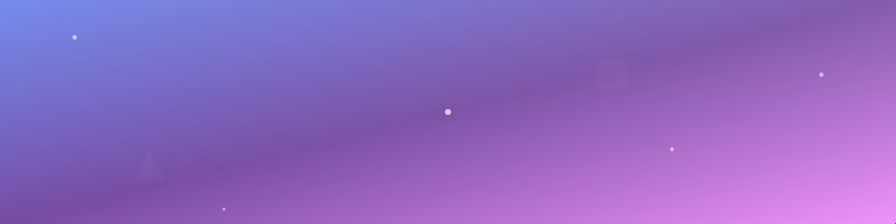
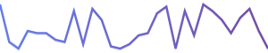
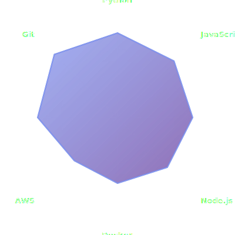
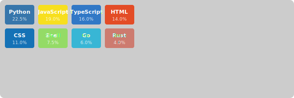

<!-- Animated Gradient Hero Banner -->

<!-- Layered Neon/Glow Headline with Typing Effect -->

 

### 🚀 Full-Stack Developer | 🎨 Creative Coder | ⚡ Tech Enthusiast

<!-- Wavy Section Divider -->

 

## 🎯 About Me

I'm a passionate developer who loves creating elegant solutions to complex problems. My journey in tech is driven by curiosity, innovation, and the desire to build products that make a difference.

- 🔭 Currently exploring cutting-edge technologies and frameworks
- 🌱 Always learning and growing my skill set
- 💡 Open to collaborating on innovative projects
- 🎮 When not coding, you'll find me gaming or exploring new tech

 

<!-- Wavy Section Divider -->

 

## 📊 GitHub Metrics

<!-- Glass Panel Aesthetic: Dynamic Metrics Panel -->
<picture>
  <source media="(prefers-color-scheme: dark)" srcset="https://raw.githubusercontent.com/lowlighter/metrics/master/github-metrics.svg">
  
</picture>

<!-- Activity Sparkline -->
  

 
📈 Recent Activity Trend

 

<!-- Wavy Section Divider -->

 

## 🐍 Contribution Snake

<!-- Contribution Snake Animation -->
<picture>
  <source media="(prefers-color-scheme: dark)" srcset="https://raw.githubusercontent.com/Senpai-Sama7/Senpai-Sama7/output/github-contribution-grid-snake-dark.svg">
  <source media="(prefers-color-scheme: light)" srcset="https://raw.githubusercontent.com/Senpai-Sama7/Senpai-Sama7/output/github-contribution-grid-snake.svg">
  
</picture>

 

<!-- Wavy Section Divider -->

 

## 💻 Tech Stack & Skills

<!-- Radial Skill Chart -->

 

<!-- Wavy Section Divider -->

 

## 🔥 Language Energy Matrix

<!-- Energy Matrix: Language Usage Heat Block -->

 
🎨 Language usage intensity visualization

 

<!-- Wavy Section Divider -->

 

## 🌐 Connect With Me

 

<!-- Wavy Section Divider -->

 

### 📈 GitHub Stats

<!-- Glass Panel Aesthetic: Stats Cards -->

 

<!-- Top Languages with Glass Effect -->

 

<!-- Wavy Section Divider -->

 

## 🎨 Recent Activity

<!--START_SECTION:activity-->
<!--END_SECTION:activity-->

 

<!-- Wavy Section Divider -->

 

### ⚡ Fun Fact

*"Code is poetry, and every commit is a verse in the story of innovation."*

 

---

💫 This README features animated SVG visuals, dynamic metrics, and auto-generated assets
 
🤖 Automatically updated via GitHub Actions | ⚠️ Subject to API rate limits
 
♿ Accessible fallbacks provided for all dynamic content

 

