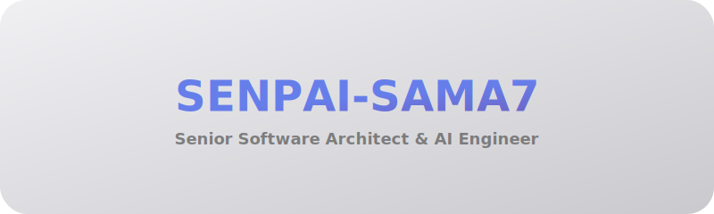
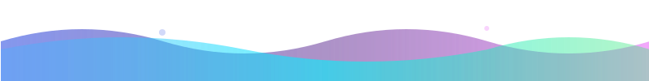
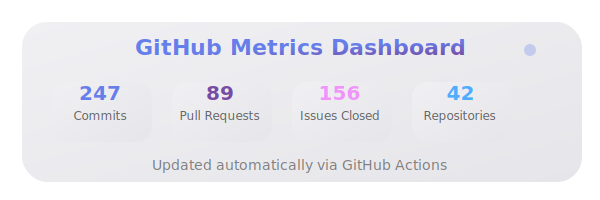
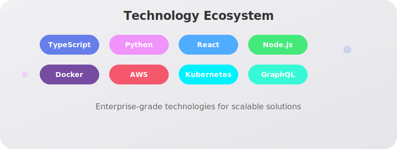
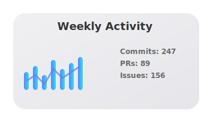
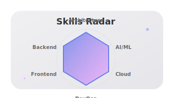
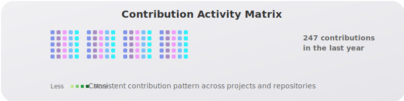

## 🚀 About Me

Passionate architect crafting **next-generation solutions** with cutting-edge technology. I specialize in **enterprise-scale systems**, **AI-driven applications**, and **cloud-native architectures** that transform businesses.

### 📊 GitHub Metrics

*Real-time metrics generated automatically*

## 🛠️ Tech Ecosystem

## 📈 Performance Analytics

<table style="border: none; background: transparent;">
<tr>
<td width="50%" align="center">

</td>
<td width="50%" align="center">

</td>
</tr>
</table>

## 🐍 Contribution Matrix

## 💡 Core Philosophy

<h3>🎯 Innovation</h3>

Pushing boundaries with emerging technologies

<h3>🚀 Performance</h3>

Optimizing for scale and efficiency

<h3>🤝 Collaboration</h3>

Building exceptional teams and products

## 🌟 Current Focus

## 📫 Connect

### 💭 *"Architecture is the art of how to waste space beautifully"*

**Building tomorrow's systems today** ✨

---

